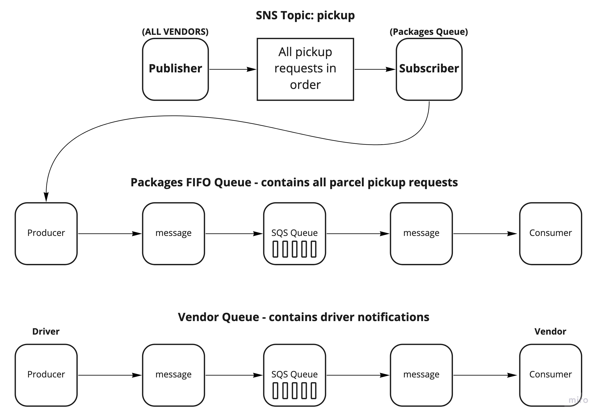

# caps-cloud

PR: [https://github.com/peterjast/caps-cloud/pull/1](https://github.com/peterjast/caps-cloud/pull/1);

## In order to run the two applications, you will need to set up the following AWS services

* SNS Topic: pickup which will receive all pickup requests from vendors

* SQS Queue (FIFO): packages which will contain all delivery requests from vendors, in order of receipt.

* Subscribe this queue to the pickup topic so all pickups are ordered

* SQS Queue (Standard) for each vendor (named for the vendor) which will contain all delivery notifications from the drivers

## Install Dependences

npm i

### Config

You will also need to create an AWS config file with the appropriate credentials depending on the permissions and configurations you implement during your set up.

## Run the applications

node driver.js

node vendor.js

## Relationship Model

;